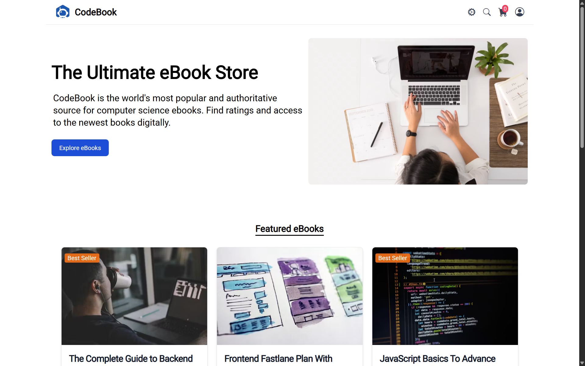

# CodeBook — Online Course Marketplace

A modern online course marketplace built with React and Spring Boot. Browse courses, add to cart, and checkout with JWT-secured authentication. Features dark mode, responsive design, and guest login.

[](https://codebookdev.vercel.app)
[](https://react.dev)
[](https://tailwindcss.com)
[](https://spring.io/projects/spring-boot)

## 🚀 Live Demo

**[https://codebookdev.vercel.app](https://codebookdev.vercel.app)**

## 📸 Screenshots

| Home Page                         | Product Detail                          | Cart                              | Dark Mode                         |
| --------------------------------- | --------------------------------------- | --------------------------------- | --------------------------------- |
|  |  |  |  |

## 🛠️ Tech Stack

- **React 18** with functional components and hooks
- **React Router v6** for client-side routing
- **Context API + useReducer** for global state management (cart, auth, filters)
- **Tailwind CSS** for utility-first styling
- **react-toastify** for notifications
- **Vercel** for deployment

## 🏗️ Component Architecture

```
App
├── Router
│   ├── Home (Featured products)
│   ├── Products (Catalog + Search + Filters)
│   ├── ProductDetail
│   ├── Cart (Protected)
│   ├── Checkout (Protected)
│   ├── Login / Register
│   └── Order Summary
└── Context Providers
    ├── AuthContext
    ├── CartContext
    └── FilterContext
```

## ✨ Features

- **Product Catalog:** Browse all courses with search and category filters
- **Featured Section:** Curated courses on homepage
- **Shopping Cart:** Add/remove items, quantity management, running total
- **JWT Authentication:** Register, login, guest login
- **Protected Routes:** Cart and checkout require authentication
- **Dark Mode:** Toggle between light and dark themes
- **Responsive Design:** Works on desktop, tablet, and mobile
- **Toast Notifications:** Success/error feedback for user actions

## 🧠 Why Context API over Redux?

For this application's scale (3 global states: auth, cart, filters), Context API with `useReducer` provides:

- **Less boilerplate** — No actions, reducers, or store setup files
- **Built-in** — No additional dependencies
- **Sufficient performance** — No complex state interactions requiring Redux middleware

## 🚀 Getting Started

### Prerequisites

- Node.js 18+
- npm or yarn
- Backend API running (see [codebook-backend](https://github.com/shyam050/codebook-backend))

### Setup

```bash
# 1. Clone
git clone https://github.com/shyam050/codebook.git
cd codebook

# 2. Install
npm install

# 3. Configure environment
cp .env.example .env
# Update REACT_APP_HOST to point to your backend

# 4. Run
npm start
```

App opens at `http://localhost:3000`

### Build for Production

```bash
npm run build
```

## 🧪 Testing

```bash
npm test
```

## 📊 Performance (Lighthouse)

| Metric             | Score |
| ------------------ | ----- |
| **Performance**    | 92    |
| **Accessibility**  | 100   |
| **Best Practices** | 95    |
| **SEO**            | 90    |


## 📱 Responsive Design

Fully responsive across all screen sizes:

- **Desktop:** 1200px+
- **Tablet:** 768px - 1199px
- **Mobile:** < 768px

## 🔗 Related

- **Backend API:** [github.com/shyam050/codebook-backend](https://github.com/shyam050/codebook-backend)
- **API Documentation:** Swagger UI at `/swagger-ui.html` on backend

## 📄 License

MIT
